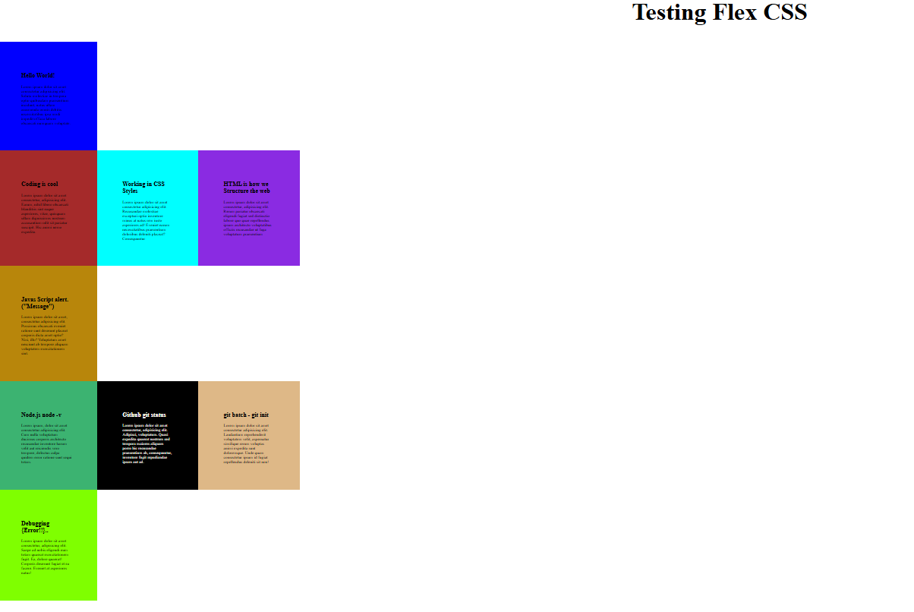

# CSS Flex Practice

👋 Hi there! I'm currently practicing **CSS** with a focus on mastering the **flex** property to create cool layouts. 🚀

## What I'm Working On
- Experimenting with different **flex** techniques for responsive design.
- Creating awesome page structures and layouts. 🎨

## Why Flex?
- Float is a powerful tool that helps position elements on a web page, allowing for more creative and flexible designs. 🖼️

## Cool Things Coming
✨ Stay tuned for more updates as I improve my CSS flex skills and create something amazing!

---

💻 Follow along with my progress!
